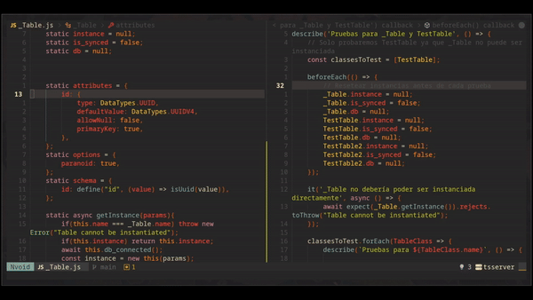

# FocusHere
FocusHere allows the highlight to only work on the code or text fragment you want to focus on.

# Why
The Zen Mode plugins are good options, but sometimes I just want to focus on one text over others without entering Zen mode.
And the truth is, I don't know if nvim already has a native function for this lol

# Requeriments
i dont know my nvim is 0.10.1

# LazyVim Install
```lua
{
    "kelvinauta/focushere.nvim",
    opts = {},
    keys = {
      { "zf", "<cmd>FocusHere<cr>", mode = "v", desc = "Focus Here", },
      { "zf", "<cmd>FocusClear<cr>", mode = "n", desc = "Clear focus", },
    }
}
```
# Functions
- `:FocusHere`: (visual mode) highlight only in this area 
- `:FocusClear`: (normal) Restore Normal highlight

# Future Features
If this repo reaches 20 stars:
- AutoMarks (customize in focus)
- Multi Focus in the same buffer
- Persistant Focus
